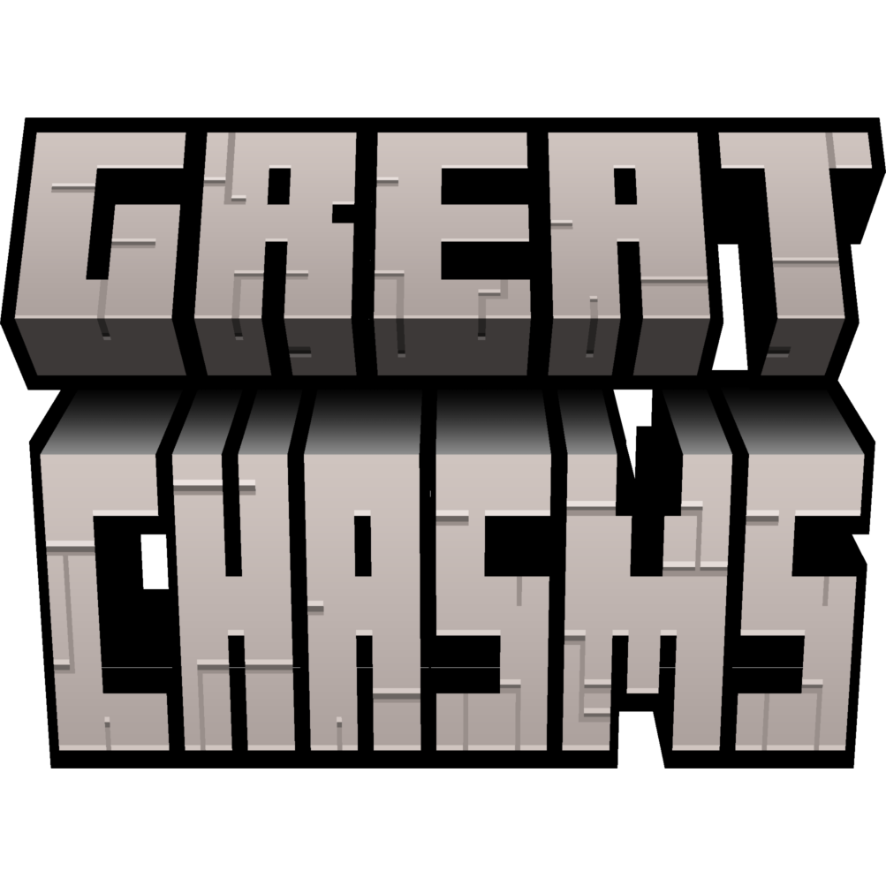

# Great Chasms

Minecraft's ravines are a few dozen blocks deep and easy to miss. Great Chasms replaces that idea
with something worth the name: rifts that run for **thousands of blocks**, open **hundreds of blocks
wide**, and drop straight past bedrock into the void.

You cannot jump one. You fly across, or you build a bridge.

**Minecraft 26.1.2 · NeoForge · Java 25**

## What you get

- **Enormous rifts.** 200 to 700 blocks across at the rim, running for thousands of blocks.
- **A drop into nothing.** They cut through bedrock, so the bottom is open sky.
- **Cliffs, not funnels.** Walls step down in terraces with ledges, bays and headlands.
- **More common at sea.** They favour deep ocean, then narrow as they come ashore.
- **The best ore hunting in the game.** One wall exposes everything from grass to deepslate.
- **Nothing built over the drop.** Structures are kept out of chasm chunks, so you will not find a
  village hanging in mid-air.

Chasms only appear in **newly generated** terrain. Explore somewhere new, or start a fresh world.

## Installing

Drop the jar in your `mods` folder. That is it.

**Optional but recommended:**

- **[Cloth Config](https://modrinth.com/mod/cloth-config)** adds an in-game settings screen, from the
  Config button in the mod list. Without it everything still works and you edit the config file.
- **A LOD mod** such as Distant Horizons or Voxy makes them far more impressive, since a 700 block
  chasm is wider than most render distances.

## Finding one

| Command | What it does |
|---|---|
| `/greatchasms locate` | Finds the nearest chasm and gives you a clickable **[Teleport]** that drops you above the rim, plus its distance, width and direction |
| `/greatchasms info` | Tells you what the mod thinks is under your feet. Handy if you are tuning settings |

`locate` is instant and does not load any terrain, so it is safe to spam.

## Playing with them

Chasms are meant to be an obstacle worth respecting.

- Bring a **water bucket** or an **elytra** before going down. The drop is fatal and the bottom is
  the void.
- Ore is exposed in the walls, so a pickaxe and some scaffolding go a long way.
- If one cuts your base off from where you are going, that is the intended experience. Build a
  bridge; they are wide enough to be a real project.

## Playing well with others

Designed alongside **Tectonic**, **Regions Unexplored**, **Streams Reflowing**, **C2ME** and
**Lithostitched**. All optional, none required.

If you use **Tectonic**, turning vanilla ravines off in its config is the intended pairing: small
ravines gone, real chasms in their place.

## Settings

Cloth Config gives you all of this in-game, and marks which settings apply instantly and which only
affect new terrain. The ones most worth touching:

| Setting | Default | What it does |
|---|---|---|
| `spacing` | 5000 | How long chasms are, and how far apart. Bigger means longer and rarer |
| `rarity` | 0.0 | How much of the world can have them. Higher is rarer |
| `minWidth` / `maxWidth` | 200 / 700 | How wide they get, in blocks |
| `oceanBias` | 0.35 | How much they prefer deep ocean |
| `terraceStrength` | 0.55 | How stepped the cliffs are. 0 makes smooth walls |
| `floorNarrowing` | 0.62 | How steep the sides are. Higher is more vertical |
| `blockStructures` | true | Keeps structures out of chasm chunks |

Changing a shape setting mid-world leaves a visible seam where new terrain meets old, so it is best
done before you explore an area.

---

## About this mod

Great Chasms is **original work**, not a fork of anything. It is written for my own modpack and is
not published to Modrinth or CurseForge, so this repository is the only place it exists.

It is not a polished release. It is developed against one pack on one machine and the shape is still
being tuned, so expect rough edges.

All rights reserved.

Technical notes for anyone reading the code live in [DEV.md](DEV.md).
